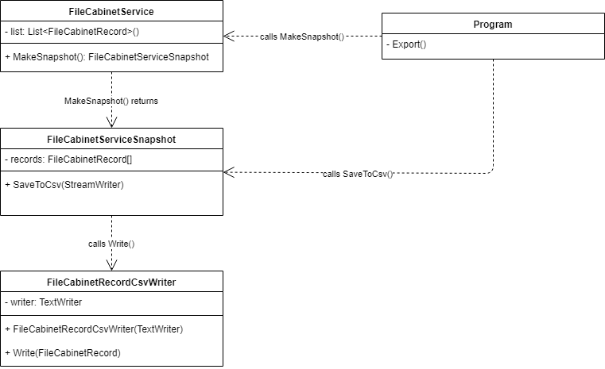
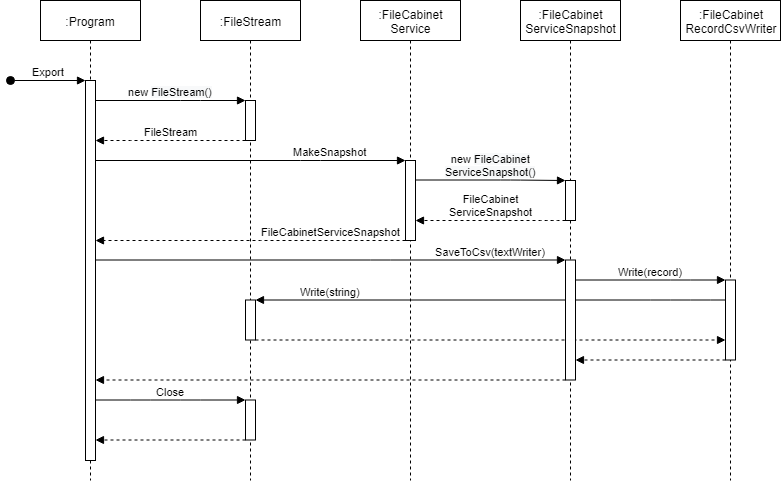
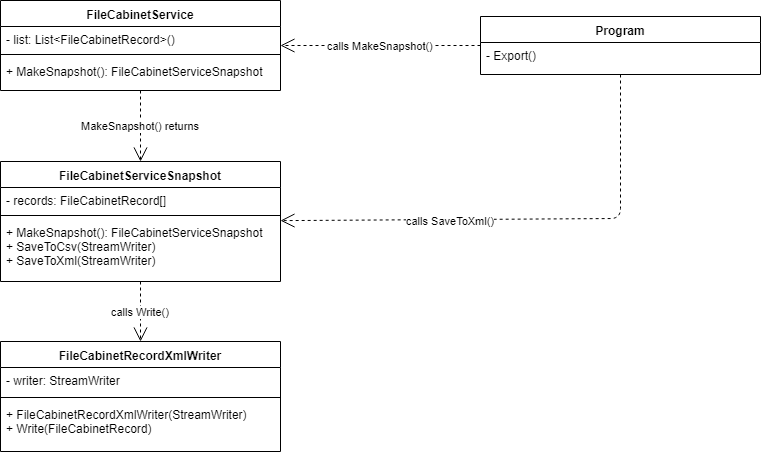

# File Cabinet

## Шаг 6 - Экспорт в CSV и XML

Цель: добавление возможностей экспорта данных приложения в файлы CSV и XML.


### Материалы

* [Что такое XML](https://javarush.ru/groups/posts/2287-chto-takoe-xml)
* [CSV](https://dic.academic.ru/dic.nsf/ruwiki/57030)
* [Serialization](https://docs.microsoft.com/en-us/dotnet/csharp/programming-guide/concepts/serialization/)
* [FileStream](https://docs.microsoft.com/en-us/dotnet/api/system.io.filestream)
* [TextWriter](https://docs.microsoft.com/en-us/dotnet/api/system.io.textwriter)
* [StreamWriter](https://docs.microsoft.com/en-us/dotnet/api/system.io.streamwriter)
* [StringWriter](https://docs.microsoft.com/en-us/dotnet/api/system.io.stringwriter)
* [XmlDocument](https://docs.microsoft.com/en-us/dotnet/api/system.xml.xmlwriter)
* [XmlWriter](https://docs.microsoft.com/en-us/dotnet/api/system.xml.xmlwriter)


### Задание

#### Экспорт в CSV

Реализуйте команду "export csv", которая должна экспортировать данные сервиса в файл формата CSV. Используйте шаблон [Memento](https://refactoring.guru/ru/design-patterns/memento) - класс _FileCabinetServiceSnapshot_. Также реализуйте класс _FileCabinetRecordCsvWriter_, который должен сериализовывать запись в формат CSV.



Пример использования:

```sh
> export csv filename.csv
All records are exported to file filename.csv.
> export csv e:\filename.csv
File is exist - rewrite e:\filename.csv? [Y/n] Y
All records are exported to file filename.csv.
> export csv e:\folder-not-exists\filename.csv
Export failed: can't open file e:\filename.csv.
```

Пример файла CSV:

```csv
Id,First Name,Last Name,Date of Birth,...
1,Petr,Semenov,12/10/1994,...
3,Petr,Golovanov,01/01/1989,...
```

Последовательность выполнения операций должна выглядеть таким образом, как изображено на [диаграмме последовательности](https://ru.wikipedia.org/wiki/%D0%94%D0%B8%D0%B0%D0%B3%D1%80%D0%B0%D0%BC%D0%BC%D0%B0_%D0%BF%D0%BE%D1%81%D0%BB%D0%B5%D0%B4%D0%BE%D0%B2%D0%B0%D1%82%D0%B5%D0%BB%D1%8C%D0%BD%D0%BE%D1%81%D1%82%D0%B8):



Commit "Add export of file cabinet records to CSV file."


#### Экспорт в XML

Реализуйте команду "export xml", которая должна экспортировать данные сервиса в файл формата XML. Также реализуйте класс _FileCabinetRecordXmlWriter_, который должен сериализовывать запись в формат XML при помощи XmlWriter. Команда должна работать аналогично команде "export csv".



Пример файла XML:

```xml
<?xml version="1.0" encoding="UTF-8"?>
<records>
	<record id="1">
		<name first="Petr" last="Semenov" />
		<dateOfBirth>12/10/1994</dateOfBirth>
		...
	</record>
	<record id="3">
		<name first="Petr" last="Golovanov" />
		<dateOfBirth>01/01/1989</dateOfBirth>
		...
	</record>
</records>
```

Commit "Add export of file cabinet records to XML file."
