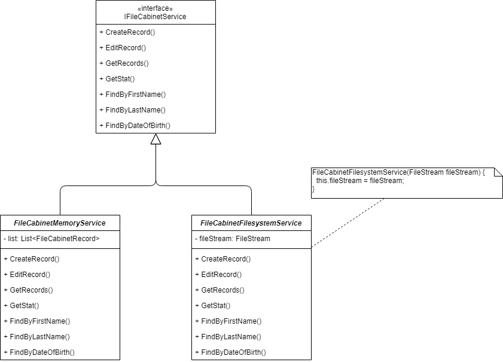
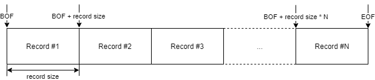

# File Cabinet

## Шаг 7 - Хранилище на файловой системе

Цель: добавление файловой системы в качестве хранилища данных.

### Задание

1. Переименуйте _FileCabinetService_ в _FileCabinetMemoryService_. Добавьте новый сервис _FileCabinetFilesystemService_.

Все методы нового сервиса должны выбрасывать [NotImplementedException](https://docs.microsoft.com/en-us/dotnet/api/system.notimplementedexception).

Commit "Move FileCabinetService to FileCabinetMemoryService. Add FileCabinetFileSystemService."

2. Добавьте новый параметр коммандной строки --storage (сокращенная форма -s), который может принимать два значения - "memory" (значение по-умолчанию) и "file". Если задано значение "memory", то должен использоваться _FileCabinetMemoryService_. Если задано значение "file", то должен использоваться _FileCabinetFilesystemService_. Должен создаваться с открытым бинарным FileStream с именем файла "cabinet-records.db".

Commit "Add storage command line parameter."

3. Реализуйте метод _FileCabinetFilesystemService.CreateRecord_, который должен записывать переданные ему данные в файл данных. Записи должны добавляться в файл последовательно, размер записи должен быть фиксированным.

Пример структуры записи в файле:

| Offset | Data Type | Field Size (bytes) | Name       | Description   |
|--------|-----------|--------------------|------------|---------------|
| 0      | short     | 2                  | Status     | Reserved      |
| 2      | int32     | 4                  | Id         | Record ID     |
| 6      | char[]    | 120                | FirstName  | First name    |
| 126    | char[]    | 120                | LastName   | Last name     |
| 246    | int32     | 4                  | Year       | Date of birth |
| 250    | int32     | 4                  | Month      | Date of birth |
| 254    | int32     | 4                  | Day        | Date of birth |
| ...    | ...       | ...                | ...        | ...           |

Добавьте в таблицу собственные поля.

Commit "Implement CreateRecord for FileCabinetFilesystemService".

4. Реализуйте метод FileCabinetFileService.GetRecords, который должен возвращать все доступные записи из файла данных. Метод должен установить указатель на начало файла (BOF) и последовательно считывать записи.

Commit "Implement GetRecords for FileCabinetFilesystemService".

5. Реализуйте метод FileCabinetFileService.GetStat, который должен возвращать статистику записей.

Commit "Implement GetStat for FileCabinetFilesystemService".

6. Реализуйте метод FileCabinetFileService.EditRecord, который должен перезаписывать данные записи. В начале метод должен осуществлять поиск нужной записи, перемещать указатель файла на начало записи, а затем производить запись обновленных данных.

Commit "Implement EditRecord for FileCabinetFilesystemService".

7. Реализуйте методы FindBy...

Commit "Implement FindBy... for FileCabinetFilesystemService".
