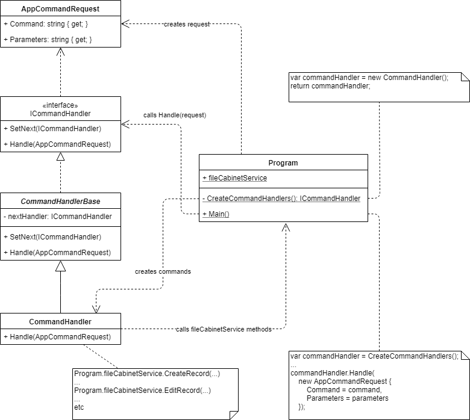
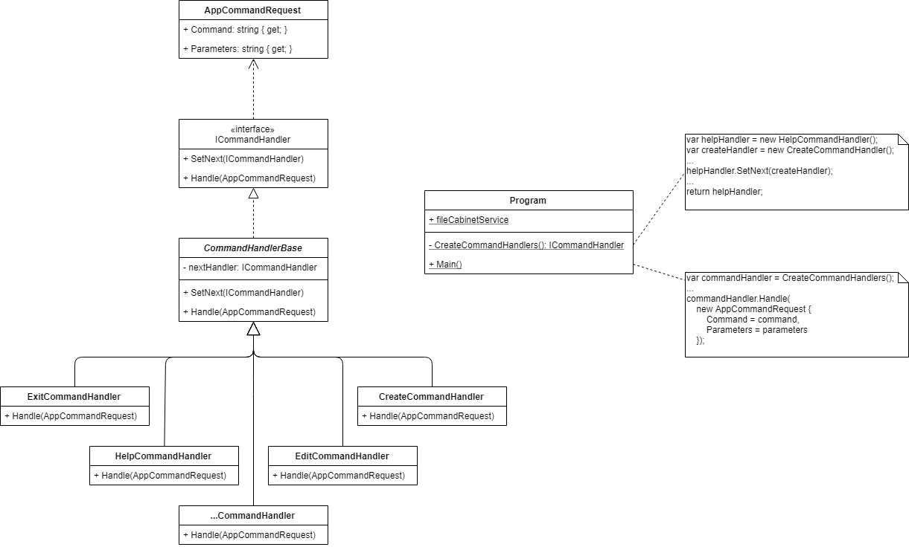
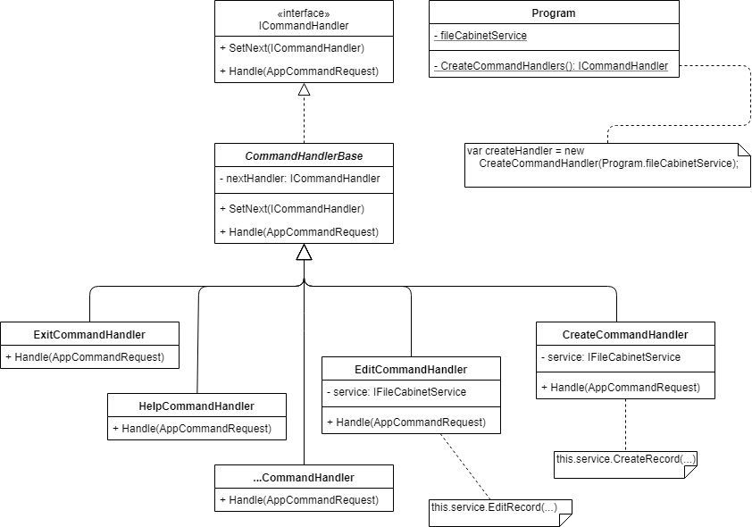
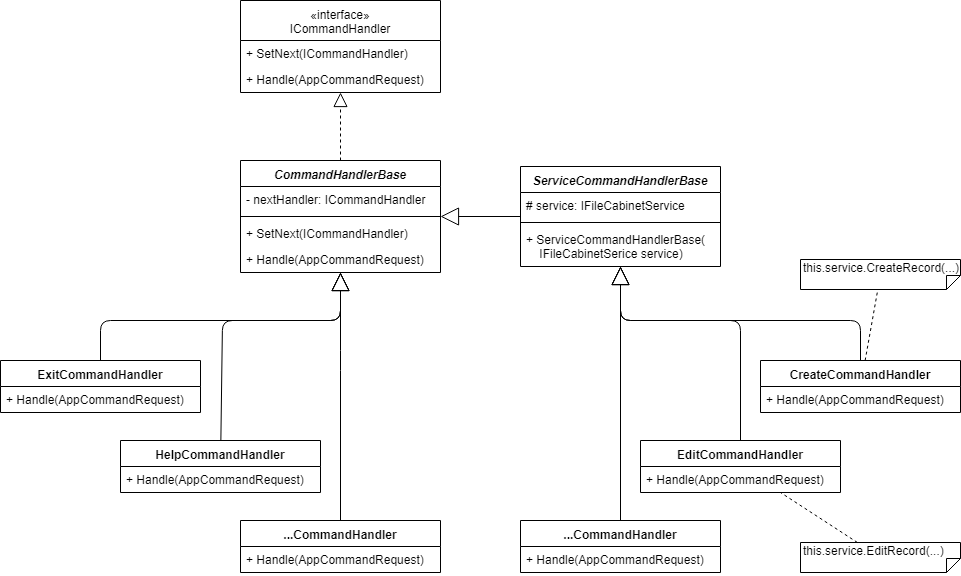
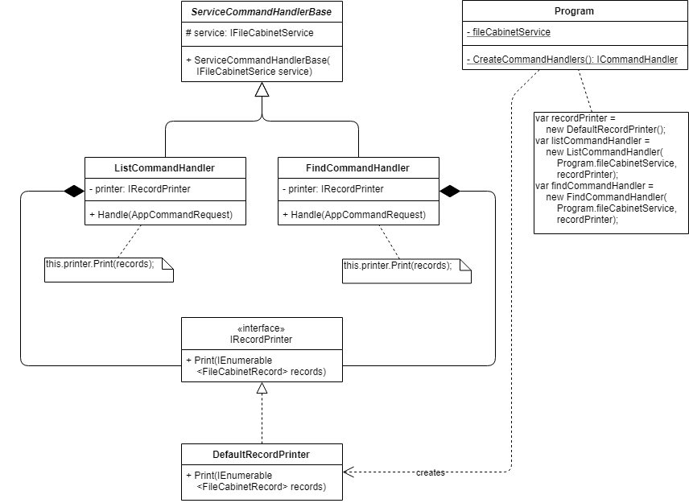
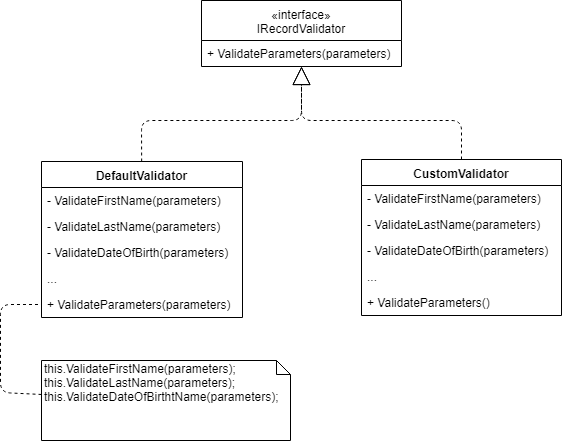
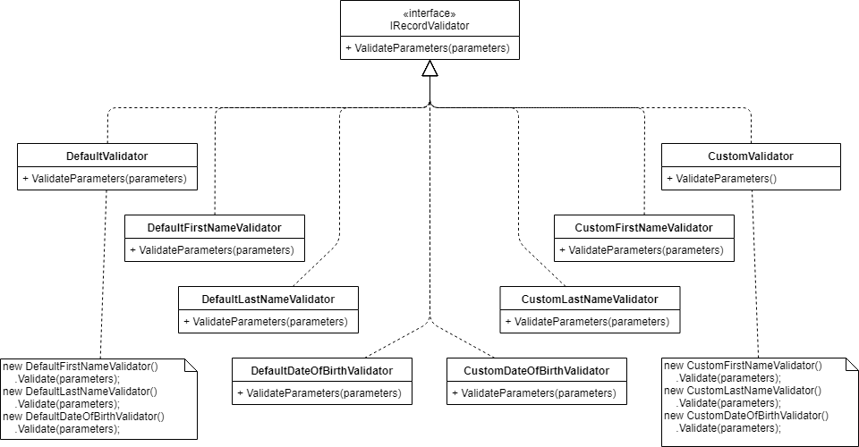
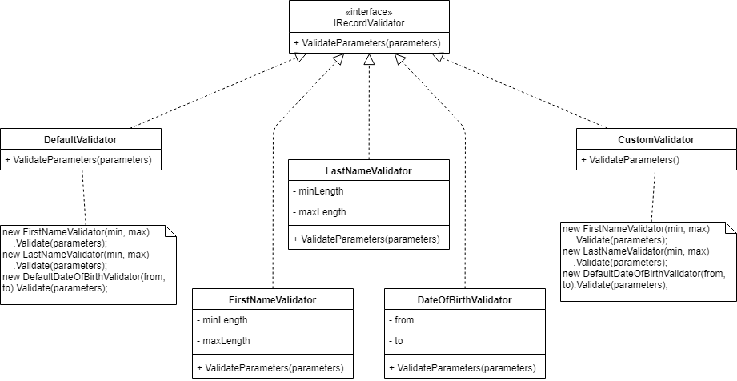
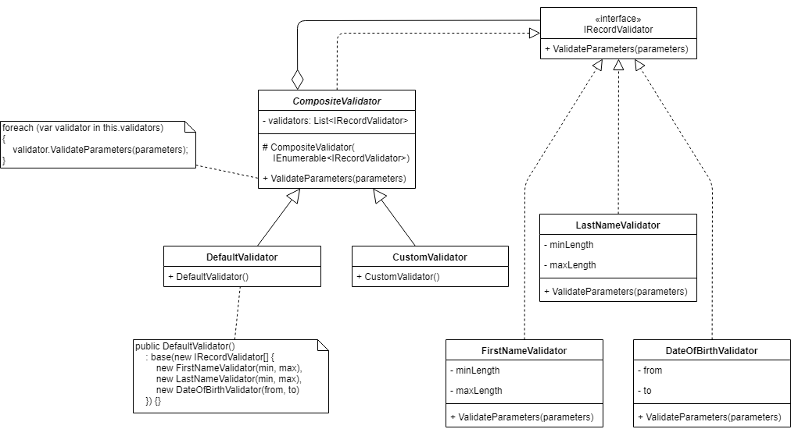
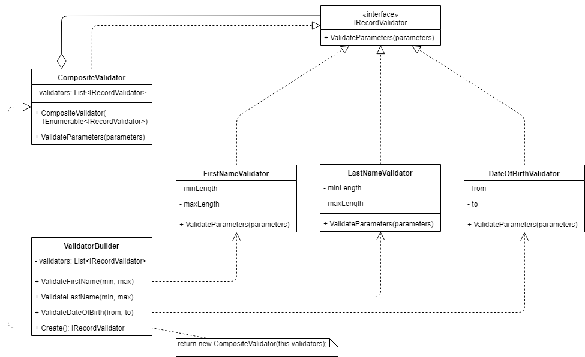

# File Cabinet

## Шаг 10 - Рефакторинг

Цель: улучшение структуры кодовой базы и качества кода.


### Задания

#### Рефакторинг команд

Обработчики команд хранятся в статическом массиве _commands_, а код обработчиков - в статических методах класса _Program_. Поддерживать этот код при большом количестве команд приложения не удобно.

1. Примените шаблон [Chain of Responsibility](https://refactoring.guru/ru/design-patterns/chain-of-responsibility):



* Создайте интерфейсы и классы, как показано на диаграмме классов, в новом каталоге _CommandHandlers_.
* Перенесите в класс _CommandHandler_ код (методы и поля) всех обработчиков.
* Сделайте поля _fileCabinetService_ и _isRunning_ публичными, чтобы обработчики могли работать с сервисом и останавливать приложение.
* Создайте новый private static метод _Program.CreateCommandHandlers_, который должен создавать и возвращать объект _CommandHandler_.
* Метод _Program.Main_ должен получать обработчик от _CreateCommandHandlers_ и вызывать метод _ICommandHandler.Handle_.

2. Примените технику [Extract Class](https://refactoring.guru/ru/extract-class) и выделите поведение всех обработчиков в отдельные классы.



Исправьте метод _CreateCommandHandlers_, чтобы он создавал все обработчики.

3. Открытое поле _fileCabinetService_ - это нарушение инкапсуляции. Сделайте это поле закрытым и примените Constructor Injection к классам-обработчикам, которые используют сервис:



4. У некоторых классов появилась общая структура - примените технику [Extract Superclass](https://refactoring.guru/ru/extract-superclass):



5. Закройте поле _isRunning_, сделайте Constructor Injection делегата _Action\<bool>_ в класс _ExitCommandHandler_. Используйте делегат, чтобы изменять значение поля _isRunning_.


#### Поддержка изменений

Команды "list" и "find" выводят на экран список записей в одном стиле, следовательно должны иметь общий код для отображения списка. Предположим, вы точно знаете, что в будущем потребуется поддерживать другой стиль отображения списка. Значит, функцию печати списка можно рассмотреть как "причину изменений" для классов, которые занимаются обработкой команд.

1. Примените Strategy Pattern к классам _ListCommandHandler_ и _FindCommandHandler_ как показано на диаграмме классов:



2. Вместо классов возможно использовать делегаты - [такой подход тоже будет стратегией](https://stackoverflow.com/questions/529524/in-c-sharp-what-is-the-difference-between-strategy-pattern-and-delegates).

* Замените _IRecordPrinter_ на _Action<IEnumerable\<FileCabinetRecord>>_ в классах-обработчиках.
* Метод _DefaultRecordPrinter.Print_ перенесите в метод _Program.DefaultRecordPrint_.
* В методе _Program.CreateCommandHandlers_ передавайте в конструктор метод  _Program.DefaultRecordPrint_ как делегат.
* В классах-обработчиках вызывайте делегат для печати списка записей.


#### Рефакторинг структуры классов

Код валидации параметров записи, который используется при создании и редактировании, сосредоточен в двух классах - _DefaultValidator_ и _CustomValidator_, которые реализуют _IRecordValidator_. Эти классы не имеют общего кода, однако выполняют одну и ту же функцию - проверяют входные параметры. Цель рефакторинга - сделать код валидации гибким и легко настраиваемым.

1. Примените технику [Extract Method](https://refactoring.guru/ru/extract-method) для кода валидации параметров:



2. Примените технику [Extract Class](https://refactoring.guru/ru/extract-class) и реализуйте _IRecordValidator_:



3. Классы _DefaultFirstNameValidator_ и _CustomFirstNameValidator_ (и другие аналогичные пары классов) имеют одинаковый код и отличаются только критериями валидации. Код можно обобщить, а критерии превратить в параметры. Это похоже на технику [Parameterize Method](https://refactoring.guru/ru/parameterize-method), однако параметрами будут поля объекта.



4. Классы _DefaultValidator_ и _CustomValidator_ обладают похожей структурой - они владеют списком валидаторов и единообразно используют критерии валидации.

Примените [Composite Pattern](https://refactoring.guru/ru/design-patterns/composite):



Теперь критерии валидации легко настраивать и изменять.

5. Чтобы более гибко настраивать критерии валидации, замените классы _DefaultValidator_ и _CustomValidator_ на [Builder Fluent Interface](https://medium.com/@sawomirkowalski/design-patterns-builder-fluent-interface-and-classic-builder-d16ad3e98f6c).



Пример использования _ValidatorBuilder_:

```cs
var validator = new ValidatorBuilder()
    .ValidateFirstName(min, max)
    .ValidateLastName(min, max)
    .ValidateDateOfBirth(from, to)
    .Create();
```

6. Создайте extension methods для _ValidatorBuilder_, которые будут создавать валидаторы для наборов правил "default" и "custom".

Пример использования:

```cs
var defaultValidator = new ValidatorBuilder().CreateDefault();
var customValidator = new ValidatorBuilder().CreateCustom();
```


#### Качество кода

Проверьте качество кода, исправьте стилистические и другие ошибки. См. раздел "Качество кода" из шага 5.