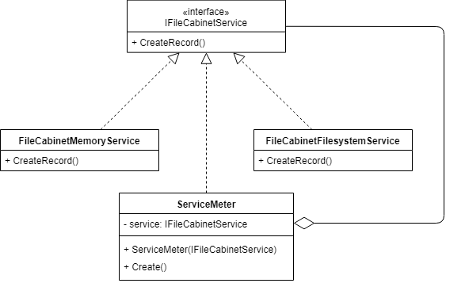
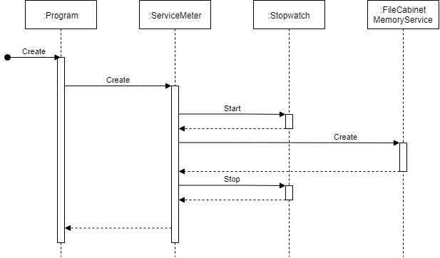
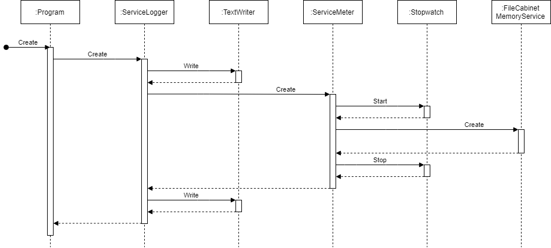

# File Cabinet

## Шаг 11 - Конфигурация и журналирование

Цель: вывод отладочной и дополнительной информации.


### Материалы

* [Под капотом у Stopwatch](https://habr.com/ru/post/226279/)


### Задание

#### Конфигурационный файл для критериев валидации

1. Сохраните текущие критерии валидации в файл _validation-rules.json_.

Пример структуры файла:

```json
{
	"default": {
		"firstName": {
			"min": 2,
			"max": 60
		},
		"lastName": {
			"min": 2,
			"max": 60
		},
		"dateOfBirth": {
			"from": "1/1/1950",
			"to": "10/8/2019"
		}
	},
	"custom": {
		"firstName": {
			"min": 5,
			"max": 80
		},
		"lastName": {
			"min": 5,
			"max": 80
		},
		"dateOfBirth": {
			"from": "1/1/1980",
			"to": "10/8/2019"
		}
	}
}
```

##### Для .NET Core

Реализуйте загрузку критериев валидации из конфигурационного файла с применением [ConfigurationBinder.Get<T>](https://docs.microsoft.com/en-us/dotnet/api/microsoft.extensions.configuration.configurationbinder.get). См. [How to use Configuration API in .net core console application](https://garywoodfine.com/configuration-api-net-core-console-application/).


##### Для .NET Framework

Установите пакет _Newtonsoft.Json_ и реализуйте загрузку параметров через [JsonConvert.DeserializeObject](https://www.newtonsoft.com/json/help/html/SerializationAttributes.htm).


#### Замер времени выполнения

Создайте новый класс _ServiceMeter_, который должен измерять время работы методов сервисов и выводить на экран. Реализуйте шаблон [Decorator](https://refactoring.guru/ru/design-patterns/decorator) как показано на диаграмме классов:



Для замеров используйте класс [Stopwatch](https://docs.microsoft.com/en-us/dotnet/api/system.diagnostics.stopwatch). Последовательность работы методов класса _ServiceMeter_:



Пример вывода результатов измерения:

```
Create method execution duration is 384 ticks.
```

Добавьте новый параметр командной строки - _use-stopwatch_, который должен включать использование замеров.


#### Журналирование работы сервиса

Создайте новый декоратор _ServiceLogger_, который должен сохранять в текстовый файл информацию о вызовах методов сервиса и переданных параметрах.



Пример формата файла:

```
10/13/2019 18:21 - Calling Create() with FirstName = 'Petr', LastName = 'Semenov', DateOfBirth = '12/10/1994'
10/13/2019 18:21 - Create() returned '10'
```

Добавьте новый параметр командной строки - _use-logger_, который должен включать использование журнала вызовов.